## BACCAble 

Direct contact: https://t.me/gaucholivido

Telegram group for BACCABLE: https://t.me/baccable 

Please donate, with Paypal or Crypto (Bitcoin)

## CREDITS

*"None of us got where we are solely by pulling ourselves up by our bootstraps. We got here because somebody — a parent, a teacher, an Ivy League crony or a few nuns — bent down and helped us pick up our boots"* Cit. Thurgood Marshall.

Thanks Sniz https://alfatuning.app/

Thanks Alexey, Alfaobd developer https://www.alfaobd.com/

Thanks normaldotcom https://github.com/normaldotcom/canable-fw

Thanks Danardi https://github.com/danardi78/Alfaromeo-Giulia-Stelvio-PIDs/

Thanks Alessandro https://github.com/anegrin

Thanks Ambrotek, Arfa, Tim, Gev, and all the Baccable Community

## DISCLAIMER

BACCABLE is a project developed exclusively for educational and research purposes. The use of this tool on vehicles operating on public roads or in any context that may cause harm to people, property, or violate applicable regulations is strictly prohibited.

The author of this project assumes no responsibility for any damages, malfunctions, or consequences resulting from the use of BACCABLE. The end user bears full civil, criminal, and legal responsibility for its use.

It is strongly recommended not to use this project in real-world vehicle applications.

## DISCLAIMER (ITALIAN VERSION)
BACCABLE è un progetto sviluppato esclusivamente a scopo didattico e di studio. È severamente vietato utilizzare questo strumento su veicoli in circolazione su strade pubbliche o in qualsiasi contesto che possa causare danni a persone, cose o violare normative vigenti.

L'autore del progetto non si assume alcuna responsabilità per eventuali danni, malfunzionamenti o conseguenze derivanti dall'uso di BACCABLE. L'utilizzo di questo strumento è interamente a rischio dell'utente finale, che si assume ogni responsabilità civile, penale e legale.

Si raccomanda di non impiegare questo progetto in applicazioni reali su veicoli.

## Scope
This project is able to use the famous CANABLE (the cheapest can bus device on the market).
Now it is also available a dedicated PCB board for the baccable, including, in a single board, 3 canable, more efficient power consumption and additional I/O for future espansion (You can find more details in the dedicated subparagraph).
Current available functions are:
- sniff on the can bus (useful for debug and exploit purposes)
- decode and store some parameters sniffed on the bus (like motor rpm, accelerator pedal position and gear selection)
- control a WS281x leds strip by means of the decoded can bus data, then lighting the leds strip according to accelerator pedal position and gear selection.
- automatically disable start&stop car functionality
- act as Immobilizer, by injecting can bus messages when required. It requires proxy alignment if you want Panic alarm too. 
- show SHIFT warning indicator on dashboard when configurable motor rpm speed is overcomed. It works only if vehicle race mode is enabled.
- add a menu to dashboard in order to show additional parameters like dpf occlusion percentage, oil pressure and performance statistics 
- route native messages encapsulating them in uds parameter response, in order to make them available to diagnostic requests performed with OBD (you can get parameters commonly not available in OBD apps).  
- enable and disable ESC and TC with left stalk button press (now it also shows race screen, avoiding the need of RDNA selector). It requires proxy alignment.
- Dyno mode disables ESC,TC,ABS. All main controls are disabled and it works on stock giulia too.
- ACC_VIRTUAL_PAD allows to enable Adaptive Cruise Control without the need to thange the wheel buttons pad: baccable will detect Cruise Control buttons press and it will send Adaptive Cruise Control messages to ECU.  It requires proxy alignment and some car prerequisites.
- LOW consumption, used to reduce current consumption if using the new Baccable pcb board.
- enable front brake from dashboard menu, in order to perform burnout start and launch assist based on torque force
- disable 4wd, for giulias and stelvios with 4wd.
- Disable seatbelt alarm
- Disable odometer blink
- Show Race Mask, shows race masks when using ESC/TC function - SOME BUG REMAINING: if screen flickers, disable this function on your Baccable
- Park Mirror, when Rear Drive and direction indicator are inserted, moves rear view mirror to mirrors position recorded when function was enabled. It Works only on vehicles with encoders inside mirrors. Just try it to check compatibility with your car.
- ACC Autostart, when veichle with ACC engaged stops behind the car in front of us, maintain active ACC (When ACC Autorestart function is disabled, ACC disengages after 5 seconds). There are 2 options: R (res button press is simulated to autorestart the veichle) and + (ACC speed up button press is simulated to autorestart the veichle).
- Close windows, allows to close windows when you close the vehicle (different modes are expected to obtain, depending on single double or triple closure of the veichle, the closure of windows or to le them stay little bit opened.
- Open windows, allows to open windows when you open the vehicle (different modes are expected to obtain, depending on single or double closure of the veichle, windows opening.
- HAS Virtual Pad, allows to simulate the button HAS (Highway Assist System) without purchasing the proper wheel keypad. It requires proxy alignment and some car prerequisites.
- QV Exhaust Valve, allows to force QV Exhaust Valve open, when you double tap on the Release button located on the gear shift lever.

Youtube overview video (1):

Youtube overview video (2):

## General Description
I started the development from the famous SLCAN firmware (https://github.com/normaldotcom/canable-fw), by porting it inside stm32Cube environment (I updated usb interface), then I added all the functions described in the manuals.

I developed a custom Board for Baccable, including 3 canable in a small factor form. You can find more details in the dedicated subparagraph.

## manuals
These are Available manuals:

|  |  |
| :---: | :---: |
| [English Manual](manuals/Baccable_manual_EN.pdf) | [Italian Manual](manuals/Baccable_manual_IT.pdf) |

## Folders content
- Subfolder firmware contains the firmware
- Subfolder hardware/canable contains canable board layout and pcb wiring diagram. It comes from https://github.com/makerbase-mks/CANable-MKS. There are different designs of canable, but theay are all similar.
- Subfolder hardware/box contains the 3d model of the cases to accomodate required components.
- Subfolder hardware/system interconnection contains interconnection diagram to connect required components
- Subfolder tools contains the famous savvyCan sniffer tool for windows (portable) and excel sheet used to calculate pwm and clocks settings.
- Subfolder hardware/newBaccableDedicatedPcb contains the new pcb for Baccable
- Subfolder Manuals contains the manuals

## Immobilizer functionality Notes
Note1: Panic alarm will start only if you previusly enabled panic alarm in your ECU, with the MES proxy alignment procedure shown in this video: 

Note1: The Immobilizer functionality will not detect the thief if you power the BACCAble with a voltage available only when the panel is switched on. 

Note2: Usb voltage is switched on as soon as the thief wakes up the rfhub. 

## DASHBOARD MENU functionality Notes
Note1: If you are not using new baccable board, you will need to connect canable boards between them as shown in the following reference image:

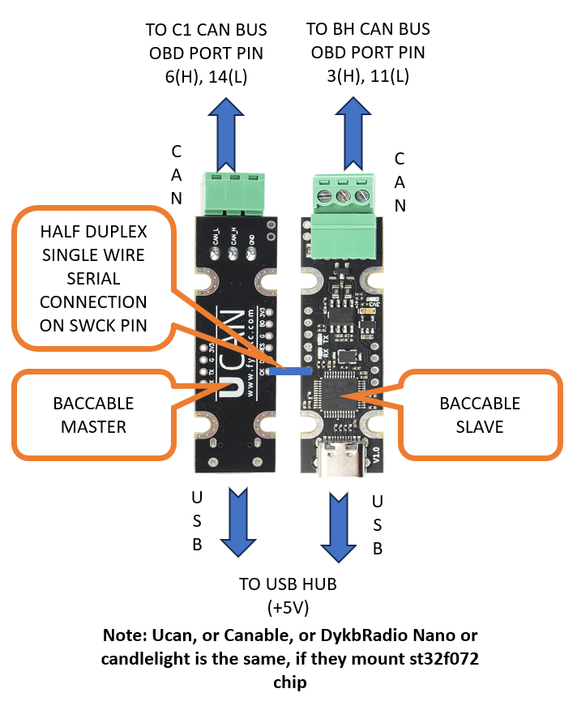

## Low Consume functionality Notes
This function, is enabled by default. If using the new Baccable PCB Board (it includes 3 baccable), it will allow the master baccable, to reset the other 2 chips and to put can transiceivers in low consumption, by means of 2 dedicated GPIO. Low consume is activated after one minute without messages on the bus, and it will wake up as soon as messages start to flow again on the bus.

## Firmware notes

Note1: The parameters array is customizable ,It resides in global_variabes.c. (search for uds_params_array array)

This is the structure of each element:
 
- name[15]:						It is the name of the parameter. shall be short otherwise the string will be cutted and not entirely shown in dashoard 
- reqId:						It is the msg id to request in UDS command. It Typically starts with 18DA....
- reqLen:						It is the total length of the can message to send
- reqData:						It is the entire can message to send. It follows the following UDS syntax:
								First byte is the length of the following bytes, 
								Second byte is the requested service (tipically 0x22, request parameter by ID),
								Third and fourth byte are the DID (the requested parameter).
- replyId:						It is the message ID of the received reply. Tipically if the reqID is 18DAAABB the replyID shall be 18DABBAA
- replyLen:						It is the number of bytes of the parameter that we want to extract from the received message
- replyOffset:					It defines where is located the parameter. 0 means that it is the first byte of the expected field of UDS message, 1 means that we shall start from second byte, and so on.
- replyValOffset: 				Once the parameter is decoded as unsigned integer, the first calculation on the value will be + replyValOffset 
- replyScale:					Once the parameter has been summed with replyValOffset, the result will be multiplied by replyScale
- replyScaleOffset:				Once the parameter has been multiplied by replyScale, the result will be summed to replyScaleOffset
- replyMeasurementUnit[7]:		It is a string appended at the end of the parameter string to define measurement unit. Too long strings will have measurement unit cutted and not shown on the dashboard.
- replyDecimalDigits:			The parameter, after previous calculations, will be converted to string, and rounded to the specified number of decimal digits. 

Note2: if you change number of elements in the array, you shall update total number of elements in the variable total_pages_in_dashboard_menu.

## BACCABLE Compile Instructions

We introduced automatic compilation on github. Stable releases are downloadable from "Releases" section:  

If you want to compile it on your PC, the easiest way is to use stm32CubeIde software.
Once the project has been opened, select the desired compile option, and the related elf file will be generated under firmware\ledsStripController, in a subfolder named according to the selected compile option. Inside that folder you will find generated elf file.

select C1, C2, BH release options, depending on the board for which you are compiling it.

Default options are enough for anyone, but if any customization is required, it can be done following instructions contained in file firmware\ledsStripController\Core\Inc\user_config.h.sample

## BACCABLE Flash Instructions

See Manual, paragraph 1.11

## The hardware using NEW BACCABLE BOARD
The following video describes the new pcb board. 

In the Box section you will find the box usable with this board.
The board can be used directly connected to obd port (recent veichles requires SGW bypass to use obd devices) , or connected to the cabling by means of a cable with obd female connector on one side, and free wires on the other side, like the following one:

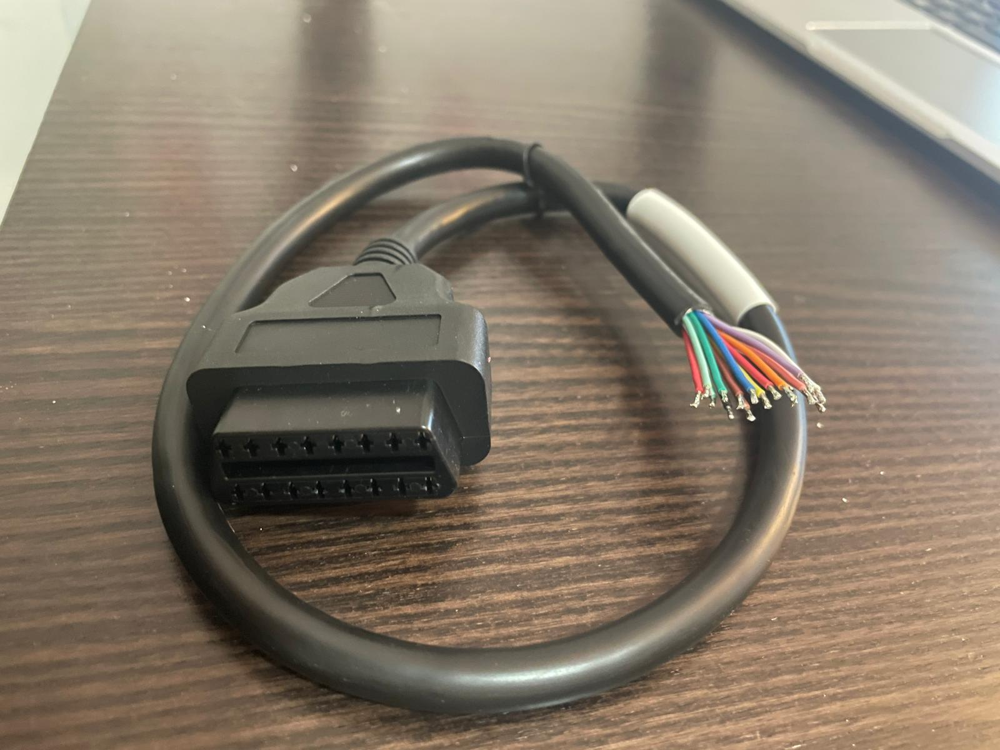

available documentation about the new board hardware is the following:

|  |  |
| :---: | :---: |
| [PCBA_3D_VIEWS](hardware/newBaccableDedicatedPcb/BACCABLE_PCBA_3D_VIEWS.pdf) | [SCHEMATIC](hardware/newBaccableDedicatedPcb/BACCABLE_SCHEMATIC.pdf) |

This is the connector pinout:

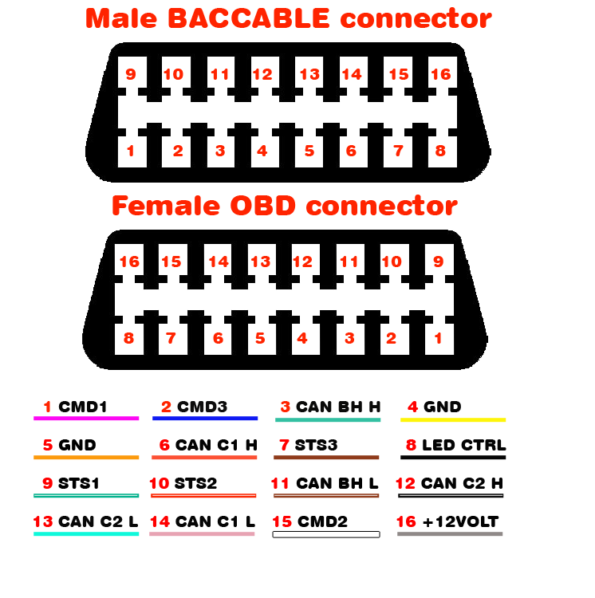

## The hardware using CANABLE
click on the following image to see the full hardware and interconnections video FOR CANABLE:

Used hardware:

Canable: This is the first I purchased (https://a.aliexpress.com/_Ev1yBz1 )
Generally speaking I found these compatible devices (It is important that the chip is a stm32F072):

    - Original MKS Canable
    - Canable DykbRadio Nano
    - Fysect ucan
	- candlelight small board ( [https://github.com/linux-automation/candleLightFD](https://github.com/linux-automation/candleLight/) )
		

Leds Strip ws2811 ip65:  https://www.ebay.it/itm/325563557492?mkcid=16&mkevt=1&mkrid=711-127632-2357-0&ssspo=wTLp3UyoQGK&sssrc=4429486&ssuid=zXyeQJ2cSnu&var=514593107226&widget_ver=artemis&media=COPY

Amazon alternatives:
Canable: https://amzn.to/3zzeNMq
Leds strip: https://amzn.to/3W3TifJ

Note: use recommended canable links cause some of them uses different st chip and I'm not sure if other chips are supported.

## The interconnections (CANABLE connections to the CAR)
Since I found how to disable Start&Stop by only sending can message, the new required connections are just: CAN bus from canable to car (termination board on canable) and power supply from usb hub 5V usb to the usb port of the canable.
If you enable the function to control a led strip, the usb data shall be connected to led strip, as defined in the old schematic here reported for reference.
If you use the function to show params on dashboard, you have to add the wire between the 2 boards (watch the diagram in the DASHBOARD MENU functionality  section of this page.

Note: In "Usage Instructions" section it is defined when you need to connect to a different can bus. The following old diagram shows the connection to C1 can bus (pin 6 and 14 of the OBD port), commonly used for immobilizer,start&stop, leds strip controller and other functionalitites, but there are also C2 can bus (pin 12 and 13 of the OBD port) required in example for ESC&TC disabler functionality and BH can bus (pin 3 and 11 of the OBD port) for the  functionality to add parameters on the dashboard). 
This is the old original wiring diagram:

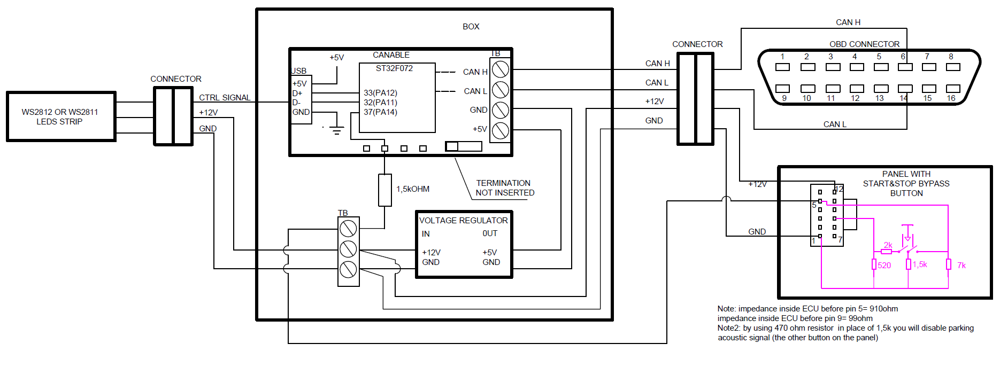

Note: if you use immobilizer function, it is suggested to remove the voltage regulator that I used to convert the 12V to 5V and directly plug the CANABLE to the  5V usb voltage, taken from the connector of the USB interface in the central area, close to cigarette lighter socket. As alterinative for immobilizer,  use the DCDC connected to a 12V of the car always available, to ensure proper working of the immobilizer. Current consumption is low but I recommend to avoid a device always draining current from your battery.

This is the obd pinout on Giulia/Stelvio:

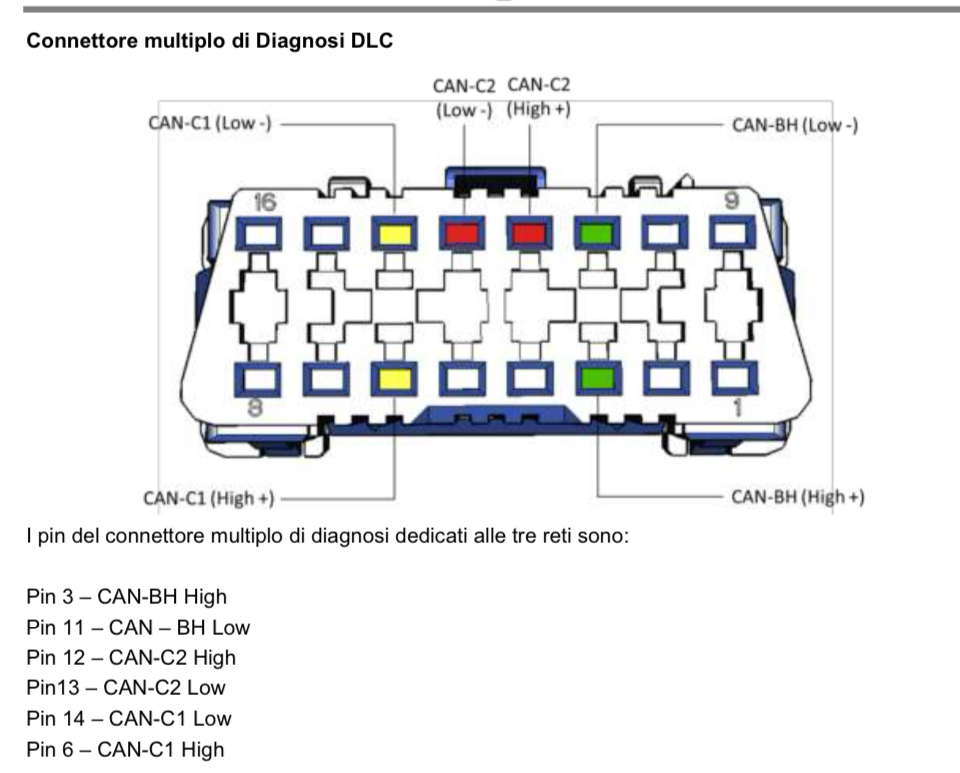

## The Box
I developed different cases.

I recently added a case for the new PCB board:

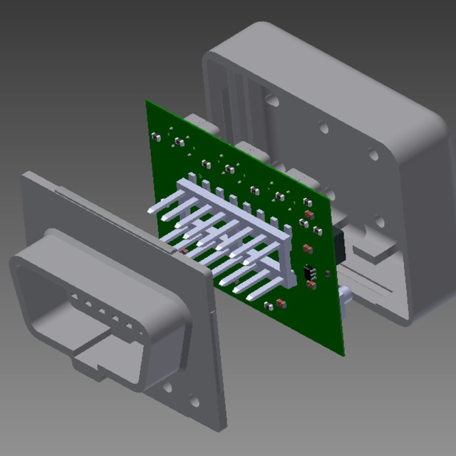

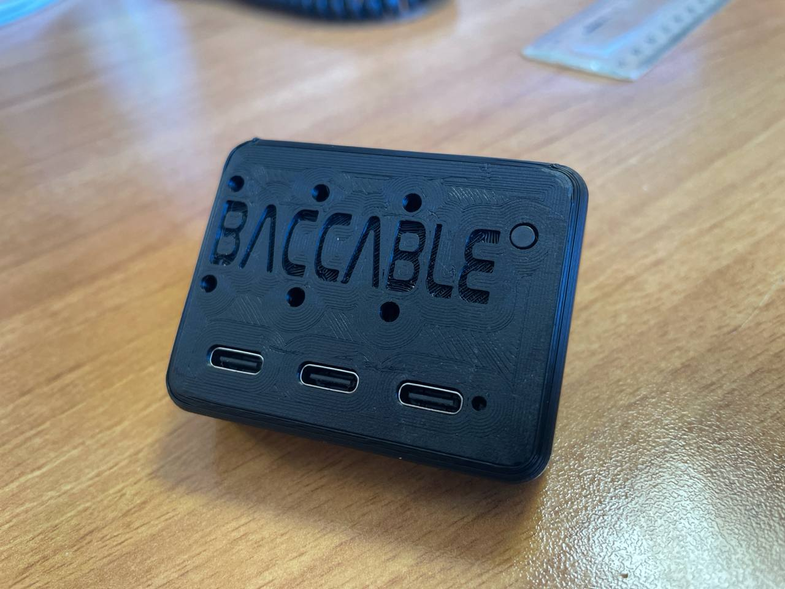

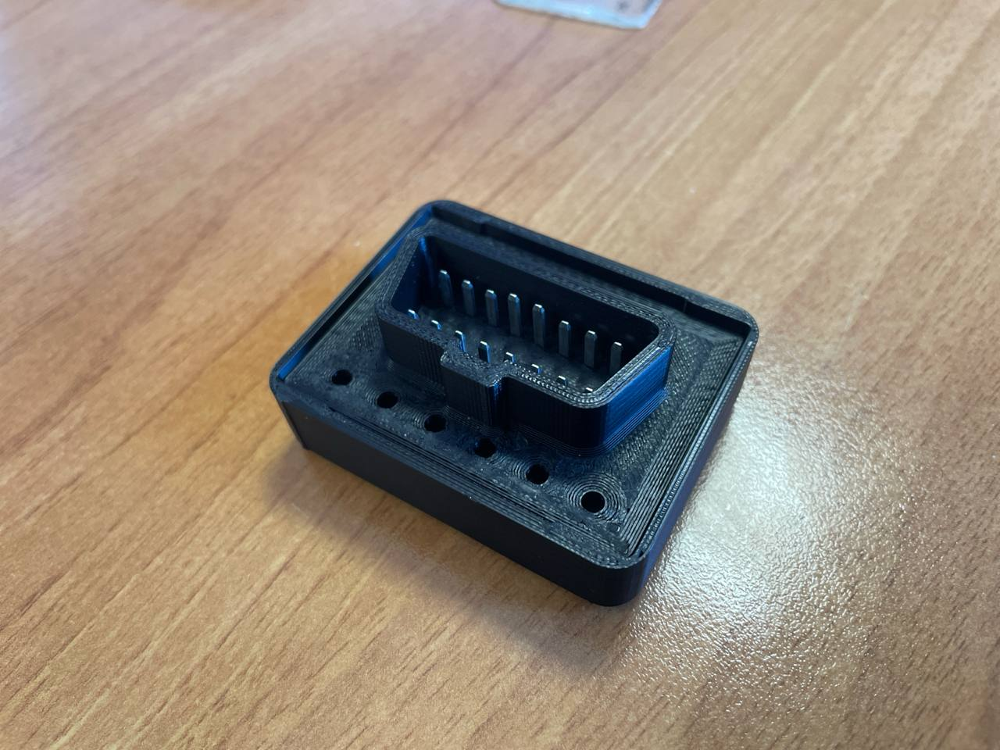

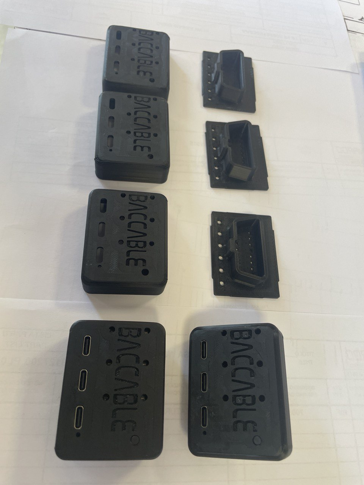

Single case for original canable or DykbRadio Nano canable:

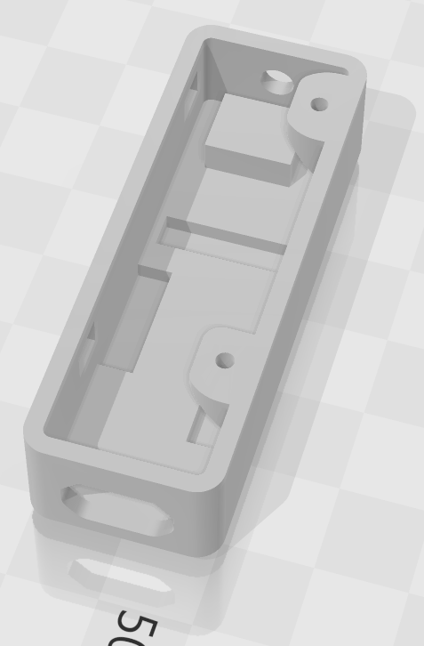

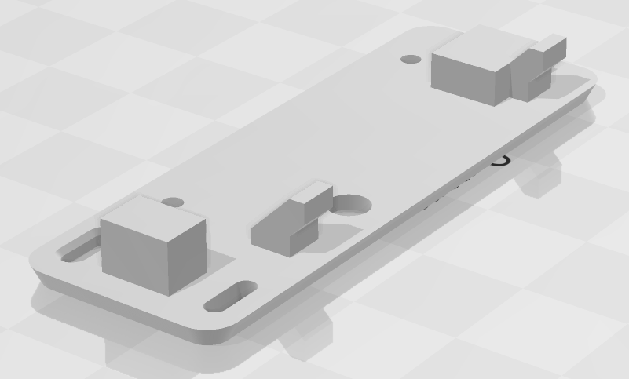

Single case for Fysect Ucan:
(uses same case of dual ucan with a dedicated cap)

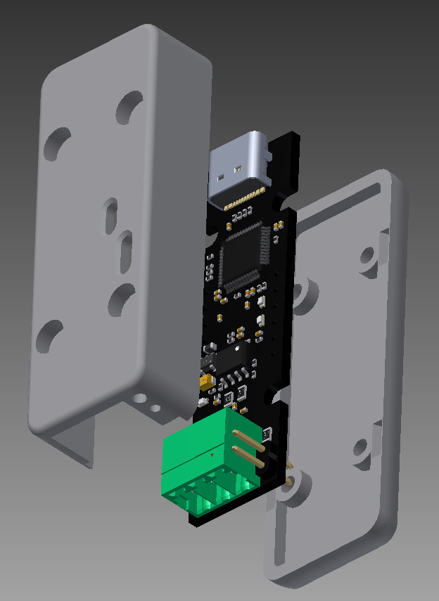

Dual case for Fysect Ucan (to accomodate 2 ucan, each one connected to a different can bus):

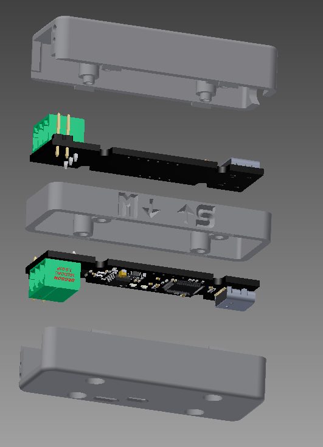

Old box to accomodate DCDC, termination board and original canable or DykbRadio Nano canable.

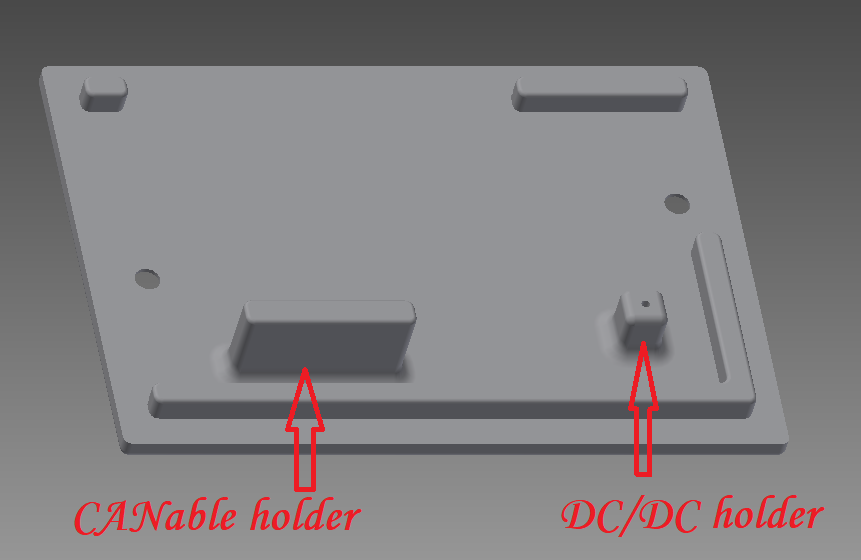

## Usage when configured to act as Canable (Sniffer)
when configured as canable the firmware acts as the classic SLCAN firmware. it means that you can use it with a pc equipped with savvycan tool, in order to sniff packets in the canbus. 
With such configuration the device is seen by the pc as a virtual serial port implementing the following serial commands:

- O - Open channel
- C - Close channel
- S0 - Set bitrate to 10k
- S1 - Set bitrate to 20k
- S2 - Set bitrate to 50k
- S3 - Set bitrate to 100k
- S4 - Set bitrate to 125k
- S5 - Set bitrate to 250k
- S6 - Set bitrate to 500k
- S7 - Set bitrate to 750k
- S8 - Set bitrate to 1M
- M0 - Set mode to normal mode (default)
- M1 - Set mode to silent mode
- A0 - Disable automatic retransmission
- A1 - Enable automatic retransmission (default)
- TIIIIIIIILDD... - Transmit data frame (Extended ID) [ID, length, data]
- tIIILDD... - Transmit data frame (Standard ID) [ID, length, data]
- RIIIIIIIIL - Transmit remote frame (Extended ID) [ID, length]
- rIIIL - Transmit remote frame (Standard ID) [ID, length]
- V - Returns firmware version and remote path as a string
Note: Channel configuration commands must be sent before opening the channel. The channel must be opened before transmitting frames.

This firmware currently does not provide any ACK/NACK feedback for serial commands.

## Understanding LED protocol

The approach used to control WS281x leds strip controller was derived from this: https://github.com/MaJerle/stm32-ws2811-ws2812-ws2812b-ws281x-tim-pwm-dma-timer where it is used a timer to start a pwm, then DMA allows a fast change of the duty cycle of the pwm.

Summarizing, the ws281x uses a control signal where each bit is transmitted as 1 or 0 with a pwm signal (with 2 different duty cycle for 0 and for 1 logic levels).
The ws281x protocol expects a 24 bits sequence (3x8) for each led, where each 8 bits defines a color (red, green and blue). 
First led will get the first 24 bits, then it sends the rest to the next led. each led does the same.
A pause in the transmission determines the end of the frame, then a new frame can be sent.
The protocol and the timings are described in the ws281x datasheet

WS2811 and WS2812 protocol is specific one and has defined values:

- Transfer rate is `800 kHz`, or `1.25us` pulse length for each bit
- Transfer length is `24` pulses for each led, that's `30us` for one LED
- Each logical bit (`1` or `0`) consists of high and low part, with different length
- Reset pulse is needed prior updating led strip, to synchronize sequence

> Minimum reset pulse length depends on WS281x device. Check datasheet for your particular unit. WS2812B says `> 50us`, while WS2811 says `> 280us`.

## STM32 DMA

DMA controllers in STM32s support various operations, one of them being super handy for our WS LED driver, called *circular operation mode*.
*Circular mode* will continuously transmit data from memory to peripheral (or, in general, can also go opposite direction) and periodically send *transfer-complete* or *half-transfer-complete* interrupts to the application.

We will use *HT* and *TC* events extensively, as they will be use to *prepare data* for next operations to transfer all bits for all leds.
