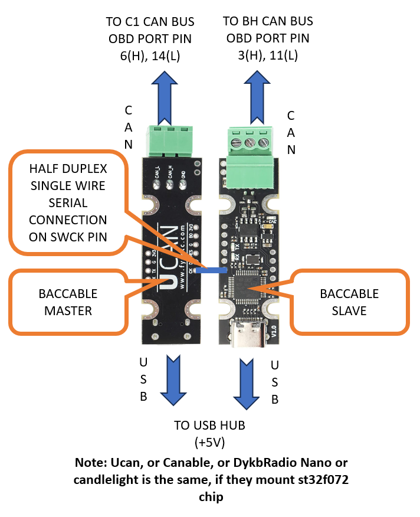
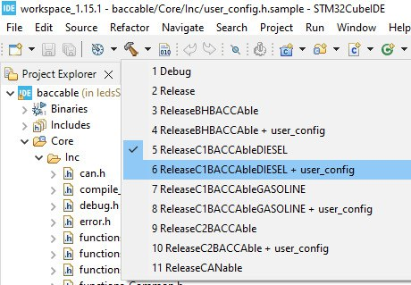

## BACCAble 

Website with full info: https://www.tr3ma.com/baccable

Direct contact: https://t.me/gaucholivido

Telegram group for BACCABLE: https://t.me/baccable 

Please donate, with Paypal or Crypto (Bitcoin)

## CREDITS

*"None of us got where we are solely by pulling ourselves up by our bootstraps. We got here because somebody — a parent, a teacher, an Ivy League crony or a few nuns — bent down and helped us pick up our boots"* Cit. Thurgood Marshall.

Thanks Sniz https://alfatuning.app/

Thanks Alexey, Alfaobd developer https://www.alfaobd.com/

Thanks normaldotcom https://github.com/normaldotcom/canable-fw

Thanks Danardi https://github.com/danardi78/Alfaromeo-Giulia-Stelvio-PIDs/

Thanks Alessandro https://github.com/anegrin

Thanks Ambrotek, Arfa, Tim, Gev, and all the Baccable Community

## DISCLAIMER

BACCABLE is a project developed exclusively for educational and research purposes. The use of this tool on vehicles operating on public roads or in any context that may cause harm to people, property, or violate applicable regulations is strictly prohibited.

The author of this project assumes no responsibility for any damages, malfunctions, or consequences resulting from the use of BACCABLE. The end user bears full civil, criminal, and legal responsibility for its use.

It is strongly recommended not to use this project in real-world vehicle applications.

## DISCLAIMER (ITALIAN VERSION)
BACCABLE è un progetto sviluppato esclusivamente a scopo didattico e di studio. È severamente vietato utilizzare questo strumento su veicoli in circolazione su strade pubbliche o in qualsiasi contesto che possa causare danni a persone, cose o violare normative vigenti.

L'autore del progetto non si assume alcuna responsabilità per eventuali danni, malfunzionamenti o conseguenze derivanti dall'uso di BACCABLE. L'utilizzo di questo strumento è interamente a rischio dell'utente finale, che si assume ogni responsabilità civile, penale e legale.

Si raccomanda di non impiegare questo progetto in applicazioni reali su veicoli.

## Scope
Baccable is able to communicate over can bus on Giulia and Stelvio veichles to implement many functions.
It is available with custom COMPACT board, or, just for partial testing, can be made with canable or ucan boards with some limits. The custom board includes, in a single board, 3 ST chips, one for each can bus, efficient power consumption and optimized electromagnetic interference management against the veichle. It includes additional expansions ports for valves remote control, or any other remote control (in example automatic driveway  gate), dedicated connector for external pedal booster (schizzaForte is the Baccable pedal booster, installed on the accelerator, allows automatic map set according to the selected drive style.
All functions and manuals are available on https://www.tr3ma.com/baccable 
Baccable can be supplied already programmed, ready to plug in diagnostic port.
If you want a ready made Baccable, required info are on https://www.tr3ma.com/baccable

Following info are only for those using canable or ucan boards

## Developers info
I started the development from the famous SLCAN firmware (https://github.com/normaldotcom/canable-fw), by porting it inside stm32Cube environment (I updated usb interface), then I added all the functions described in the manuals.

## Folders content
- Subfolder firmware contains the firmware
- Subfolder hardware/canable contains canable board layout and pcb wiring diagram. It comes from https://github.com/makerbase-mks/CANable-MKS. There are different designs of canable, but theay are all similar.
- Subfolder hardware/box contains the 3d model of the cases to accomodate required components.
- Subfolder hardware/system interconnection contains interconnection diagram to connect required components
- Subfolder tools contains the famous savvyCan sniffer tool for windows (portable) and excel sheet used to calculate pwm and clocks settings.
- Subfolder hardware/newBaccableDedicatedPcb contains the new pcb for Baccable
- Subfolder Manuals contains the manuals

## DASHBOARD MENU functionality Notes

For communication between ucan or canable, you will need to connect canable boards as shown in the following reference image:

## Firmware notes

Note1: The parameters array is customizable

This is the structure of each element:
 
- name[15]:						It is the name of the parameter. shall be short otherwise the string will be cutted and not entirely shown in dashoard 
- reqId:						It is the msg id to request in UDS command. It Typically starts with 18DA....
- reqLen:						It is the total length of the can message to send
- reqData:						It is the entire can message to send. It follows the following UDS syntax:
								First byte is the length of the following bytes, 
								Second byte is the requested service (tipically 0x22, request parameter by ID),
								Third and fourth byte are the DID (the requested parameter).
- replyId:						It is the message ID of the received reply. Tipically if the reqID is 18DAAABB the replyID shall be 18DABBAA
- replyLen:						It is the number of bytes of the parameter that we want to extract from the received message
- replyOffset:					It defines where is located the parameter. 0 means that it is the first byte of the expected field of UDS message, 1 means that we shall start from second byte, and so on.
- replyValOffset: 				Once the parameter is decoded as unsigned integer, the first calculation on the value will be + replyValOffset 
- replyScale:					Once the parameter has been summed with replyValOffset, the result will be multiplied by replyScale
- replyScaleOffset:				Once the parameter has been multiplied by replyScale, the result will be summed to replyScaleOffset
- replyMeasurementUnit[7]:		It is a string appended at the end of the parameter string to define measurement unit. Too long strings will have measurement unit cutted and not shown on the dashboard.
- replyDecimalDigits:			The parameter, after previous calculations, will be converted to string, and rounded to the specified number of decimal digits. 

## BACCABLE Compile Instructions

We introduced automatic compilation on github. Stable releases are downloadable from "Releases" section:  

If you want to compile it on your PC, the easiest way is to use stm32CubeIde software.
Once the project has been opened, select the desired compile option, and the related elf file will be generated under firmware\ledsStripController, in a subfolder named according to the selected compile option. Inside that folder you will find generated elf file.

select C1, C2, BH release options, depending on the board for which you are compiling it.

Default options are enough for anyone, but if any customization is required, it can be done following instructions contained in file firmware\ledsStripController\Core\Inc\user_config.h.sample

## BACCABLE Flash Instructions

See Manual, paragraph 1.11

## The hardware using CANABLE

I found these compatible devices (It is important that the chip is a stm32F072):

    - Original MKS Canable
    - Canable DykbRadio Nano
    - Fysect ucan
	- candlelight small board ( [https://github.com/linux-automation/candleLightFD](https://github.com/linux-automation/candleLight/) )
		
## Compatible leds strip

Leds Strip ws2811 ip65:  

https://www.ebay.it/itm/325563557492?mkcid=16&mkevt=1&mkrid=711-127632-2357-0&ssspo=wTLp3UyoQGK&sssrc=4429486&ssuid=zXyeQJ2cSnu&var=514593107226&widget_ver=artemis&media=COPY

https://amzn.to/3W3TifJ

## Usage when configured to act as Canable (Sniffer)
The new function SNIFFER inside Main Setup Menu no more requires to flash dedicated firmware for flashing. See manual.
This section is left for reference.
Old method to flash requires to flash the baccable with another firmware named CANABLE or ACT_AS_CANABLE that you can find in the compiled files.

When flashed with CANABLE firmware, it acts as the classic SLCAN firmware. it means that you can use it with a pc equipped with savvycan tool, in order to sniff packets in the canbus. 
With such configuration the device is seen by the pc as a virtual serial port implementing the following serial commands:

- O - Open channel
- C - Close channel
- S0 - Set bitrate to 10k
- S1 - Set bitrate to 20k
- S2 - Set bitrate to 50k
- S3 - Set bitrate to 100k
- S4 - Set bitrate to 125k
- S5 - Set bitrate to 250k
- S6 - Set bitrate to 500k
- S7 - Set bitrate to 750k
- S8 - Set bitrate to 1M
- M0 - Set mode to normal mode (default)
- M1 - Set mode to silent mode
- A0 - Disable automatic retransmission
- A1 - Enable automatic retransmission (default)
- TIIIIIIIILDD... - Transmit data frame (Extended ID) [ID, length, data]
- tIIILDD... - Transmit data frame (Standard ID) [ID, length, data]
- RIIIIIIIIL - Transmit remote frame (Extended ID) [ID, length]
- rIIIL - Transmit remote frame (Standard ID) [ID, length]
- V - Returns firmware version and remote path as a string
Note: Channel configuration commands must be sent before opening the channel. The channel must be opened before transmitting frames.

This firmware currently does not provide any ACK/NACK feedback for serial commands.

## Understanding LED protocol

The approach used to control WS281x leds strip controller was derived from this: https://github.com/MaJerle/stm32-ws2811-ws2812-ws2812b-ws281x-tim-pwm-dma-timer where it is used a timer to start a pwm, then DMA allows a fast change of the duty cycle of the pwm.

Summarizing, the ws281x uses a control signal where each bit is transmitted as 1 or 0 with a pwm signal (with 2 different duty cycle for 0 and for 1 logic levels).
The ws281x protocol expects a 24 bits sequence (3x8) for each led, where each 8 bits defines a color (red, green and blue). 
First led will get the first 24 bits, then it sends the rest to the next led. each led does the same.
A pause in the transmission determines the end of the frame, then a new frame can be sent.
The protocol and the timings are described in the ws281x datasheet

WS2811 and WS2812 protocol is specific one and has defined values:

- Transfer rate is `800 kHz`, or `1.25us` pulse length for each bit
- Transfer length is `24` pulses for each led, that's `30us` for one LED
- Each logical bit (`1` or `0`) consists of high and low part, with different length
- Reset pulse is needed prior updating led strip, to synchronize sequence

> Minimum reset pulse length depends on WS281x device. Check datasheet for your particular unit. WS2812B says `> 50us`, while WS2811 says `> 280us`.

## STM32 DMA

DMA controllers in STM32s support various operations, one of them being super handy for our WS LED driver, called *circular operation mode*.
*Circular mode* will continuously transmit data from memory to peripheral (or, in general, can also go opposite direction) and periodically send *transfer-complete* or *half-transfer-complete* interrupts to the application.

We will use *HT* and *TC* events extensively, as they will be use to *prepare data* for next operations to transfer all bits for all leds.
