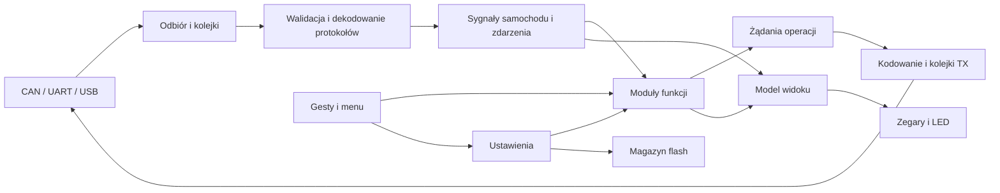

**Propozycja refaktoryzacji BACCAble — analiza z 9 września 2026**

Punkt odniesienia: commit `4e43af1` (`feat: refactor menu items (#1)`). Dokument opisuje propozycję zmian; kod firmware nie został zmieniony podczas analizy.

Największą korzyść da rozdzielenie komunikacji, interpretacji danych samochodu, logiki poszczególnych funkcji i prezentacji. Obecnie jedna operacja użytkownika może przechodzić przez parser CAN, globalne zmienne, kolejkę UART, drugi procesor, kod menu i zapis flash. Poszczególne warstwy zmieniają wspólny stan, a przyjęcie polecenia do kolejki bywa traktowane jak wykonanie operacji. To utrudnia zarówno diagnozowanie błędów, jak i dodawanie funkcji.

Zacząłbym od usterek pamięci, komunikacji i trwałości danych, następnie wydzielał funkcje wraz z ich testami. Pozostawiłbym C, HAL i obecną pętlę główną. Na tym etapie nie ma uzasadnienia dla RTOS, nowego języka ani rozbudowanego frameworka zdarzeń.

**Zakres i sposób sprawdzenia**

Przegląd objął wszystkie moduły aplikacyjne C/H, inicjalizację i przerwania, konfigurację wariantów, Makefile, workflow CI/release, integrację USB/FatFs oraz dokumentację funkcji. Własny kod aplikacyjny to około 8,3 tys. fizycznych linii w 26 plikach C, po wyłączeniu bibliotek i części standardowych plików systemowych. Biblioteki HAL/CMSIS/FatFs analizowałem w zakresie kontraktów używanych przez aplikację; nie był to osobny audyt każdej linii bibliotek producentów ani projektu elektroniki.

Wykonałem czyste kompilacje w osobnych katalogach oraz małe próby na komputerze, wykorzystujące funkcje wyodrębnione z projektu. Próby pamięci korzystały z AddressSanitizer/UndefinedBehaviorSanitizer. Próby asynchronicznego I/O używały atrap HAL/USB. Nie wykonywałem testów na płytce ani samochodzie.

| Konfiguracja | Wynik czystej kompilacji | Flash programu: `text + data` | Zajęcie regionu programu 64 KiB |
| --- | --- | ---: | ---: |
| C1 | OK | 61 696 B | 94,1% |
| C2 | OK | 30 020 B | 45,8% |
| BH | OK | 30 504 B | 46,5% |
| CANable | OK | 25 276 B | 38,6% |
| C1 + DEBUG | OK, ostrzeżenia `#warning` | 64 644 B | 98,6% |
| C1 + duży wyświetlacz | OK | 62 528 B | 95,4% |
| C1 + sterownik szeregowy Schizzaforte | OK, dwa ostrzeżenia nieużywanych zmiennych | 64 744 B | 98,8% |
| C2 + DEBUG, BH + DEBUG | Błąd: nieznany typ `FATFS` | — | — |

Toolchain: Arm GNU Toolchain 15.2.Rel1, GCC 15.2.1. Cztery podstawowe konfiguracje przeszły z obecnym `-Wall` bez ostrzeżeń. To potwierdza możliwość zbudowania projektu, lecz nie poprawność działania. C1 ma tylko 3840 B zapasu w obecnym regionie programu, a wariant DEBUG 892 B; koszt nowych abstrakcji musi być mierzony. Lokalnie nie uruchamiałem cppcheck, który jest skonfigurowany w CI.

**Mapa funkcjonalności i proponowane granice modułów**

Urządzenie ma trzy współpracujące role firmware: C1 obsługuje główną logikę i magistralę 500 kb/s, C2 funkcje dynamiki na 500 kb/s, a BH magistralę nadwozia 125 kb/s i prezentację na zegarach. Procesory komunikują się przez półdupleksowy UART. Osobny wariant CANable udostępnia CAN przez USB CDC.

| Obszar | Co oferuje obecny kod | Docelowa odpowiedzialność |
| --- | --- | --- |
| Dane samochodu | Obroty, prędkość, bieg, moment/moc, temperatury, napięcie, stan DNA, tempomatu/ACC, regeneracji | Dekodery ramek i model sygnałów z jednostką, ważnością oraz czasem ostatniej aktualizacji |
| Parametry diagnostyczne | Odczyty UDS, strony dla benzyny i diesla, pary wartości, mieszanie danych natywnych z diagnostycznymi | Katalog parametrów oraz klient UDS niezależne od aktualnej strony menu |
| Menu i ekran | Nawigacja przyciskami samochodu, ustawienia, wybór widocznych parametrów, przesyłanie tekstu C1 → BH | Osobno interpretacja gestów, nawigacja, model widoku i renderer |
| Pomiary osiągów | 0–100 i 100–200 km/h, rekordy, reset i zapis wyników | Samodzielny moduł chronometru korzystający z sygnałów prędkości i czasu |
| Start & Stop, immobilizer | Automatyczne wyłączanie S&S, immobilizer i tryb panic | Dwie niezależne funkcje z jawnymi warunkami aktywacji, wyłączenia i restartu |
| ESC/TC i ekran Race | Zmiana zachowania ESC/TC oraz wskazania trybu na zegarach przez kilka procesorów | Moduł koordynujący stan żądany i stan potwierdzony |
| Hamulce, launch, dyno, 4WD | Wymuszanie hamulców przednich, zwolnienie przy progu momentu, tryb hamowni, odłączanie napędu | Oddzielne maszyny stanów, ze wspólną obsługą transakcji diagnostycznych |
| ACC i HAS | Wirtualne przyciski, automatyczne wznowienie ACC, symulacja przycisku HAS | Moduły sterujące gestami i sekwencjami, z wygasaniem sygnałów wejściowych |
| Funkcje komfortu | Domykanie/uchylanie szyb, lusterka parkingowe z zapamiętywaniem, ograniczenie migania przebiegu, ustawienie alarmu pasów | Osobne moduły; obsługa lusterka nie powinna znać indeksów flash ani menu |
| Wydech QV | Sterowanie klapami i wyjściami MOSFET dla pilota | Jeden moduł impulsów wyjściowych gwarantujący zakończenie impulsu również po wyłączeniu funkcji |
| Pedal booster | Mapa zależna od DNA, wybór ręczny, poziom działania, komunikacja Schizzaforte | Sterownik protokołu i funkcja wyboru mapy |
| Sygnalizacja | LED WS281x, wskaźnik zmiany biegu, sygnalizacja regeneracji DPF | Renderer LED/DMA oddzielony od źródła wartości i priorytetów alarmów |
| Zasilanie i współpraca procesorów | Wykrycie bezczynności, reset/wybudzenie procesorów podrzędnych, odtwarzanie ustawień | Moduł cyklu życia systemu i synchronizacji stanu po restarcie |
| CANable | SLCAN przez USB: ramki standardowe/rozszerzone, RTR, bitrate, tryb silent, informacje diagnostyczne | Parser tekstowy, konfiguracja CAN i nieblokujące kolejki USB |
| Ustawienia i USB MSC | Zapis ustawień/statystyk/widoczności, dysk FAT na wewnętrznej flash w BH/C2 | Magazyn ustawień oddzielony od woluminu USB i jawna mapa partycji |

Nie każda pozycja obecna w źródłach jest gotową funkcją produktu. Odczyt błędów ma akcję „To Be Done”, zdalny rozruch jest zakomentowany, „Save Log to File” zapisuje przykładowe `Hello World`, a `eujot` jest zapisywanym przełącznikiem bez zachowania wykonawczego. Animacje świateł i jingle zawierają kod eksperymentalny lub nieaktywny. Wariant szeregowy wymaga określenia kontraktu: nie realizuje pełnego, przezroczystego mostu USB ↔ UART.

W ramach refaktoryzacji oznaczyłbym te elementy jako niedostępne/eksperymentalne i oddzielił od obsługiwanych funkcji. Dokończenie ich stanowiłoby osobne zadania funkcjonalne.

**Problemy do usunięcia w pierwszej kolejności**

Oznaczenia dowodów: **odtworzone** — próba programowa potwierdziła wskazany mechanizm; **kod** — problem wynika bezpośrednio z implementacji; **sprzęt** — jego rzeczywista częstotliwość lub skutek wymaga pomiaru na urządzeniu. Priorytet P0 oznacza pierwszą serię poprawek, P1 kolejną serię, a P2 uporządkowanie po ustabilizowaniu podstaw.

| Priorytet | Usterka i skutek | Dowód oraz miejsce | Proponowana zmiana |
| --- | --- | --- | --- |
| P0 | Cofanie po ukrytych parametrach może odczytać element 255 tablicy o długości 240. Zmienna `uint8_t` nigdy nie spełnia warunku „mniejsza od zera”. | **Odtworzone**, `getPreviousVisibleParam`, [functions_C1baccable.c](../../firmware/ledsStripController/Core/Src/functions_C1baccable.c), okolice 1359 | Ograniczone wyszukiwanie po rzeczywistej liczbie stron; jawny przypadek pustej listy |
| P0 | `floatToStr` może pisać poza bufor, gdy część całkowita nie mieści się w polu. | **Odtworzone** dla bufora 4 B i wartości 12345, [functions_Common.c](../../firmware/ledsStripController/Core/Src/functions_Common.c), od 11 | Formatter z kontrolą całkowitej liczby zapisanych znaków; określone zachowanie dla przepełnienia, NaN i wartości ujemnych |
| P0 | Renderowanie pola szerokości 8 odczytuje pamięć za końcem literału `"Diesel"`. | **Odtworzone**, `setup_write_text_field`, [setup_menu_entries.c](../../firmware/ledsStripController/Core/Src/setup_menu_entries.c), 328 i 458 | Po pierwszym NUL wyłącznie dopełniać pole spacjami |
| P0 | Kopiowanie `DLC` bajtów ramki 0x2FA do trzybajtowego `ACC_msg_data` pozwala nadpisać pamięć. Inne dekodery czytają pola bez weryfikacji minimalnego DLC. | **Kod**, [processingMessage0x000002FA.c](../../firmware/ledsStripController/Core/Src/processingMessage0x000002FA.c), 38 i 50; także dekodery standardowe | Walidować typ, ID i długość przed dekodowaniem; niezależnie sprawdzać `DLC <= 8` przy nadawaniu |
| P0 | USB może wejść w nieskończone oczekiwanie: parser działa z wyłączonymi przerwaniami, a wysyłka czeka na USB/SysTick. | **Odtworzone z atrapami HAL/USB** dla `V\rV\r`, [usbd_cdc_if.c](../../firmware/ledsStripController/USB_DEVICE/App/usbd_cdc_if.c), 174 i 246; potwierdzenie przebiegu na urządzeniu pozostaje do wykonania | Krótkie sekcje krytyczne, kolejka TX, wznowienie po zakończeniu transferu; sprawdzać stan konfiguracji USB |
| P0 | Niepełna komenda SLCAN może ponownie nadać poprzednią ramkę. Parser nie przestrzega przekazanej długości wejścia. | **Odtworzone**: poprawne `t1231AA`, a następnie samo `t` ponownie wysyła ID 0x123 i 0xAA; [slcan.c](../../firmware/ledsStripController/Core/Src/slcan.c), od 80 | Ścisła walidacja długości komendy, cyfr hex, zakresu ID/DLC i wariantu RTR; bez efektów ubocznych przy błędzie |
| P0 | Bufor UART jest zwalniany z kolejki natychmiast po rozpoczęciu asynchronicznej transmisji. Kolejny wpis może zmienić bajty trwającej transmisji. | **Odtworzone z symulacją asynchronicznego odbiorcy**, [uart.c](../../firmware/ledsStripController/Core/Src/uart.c), 585, 636 i 657 | Bufor pozostaje zajęty do callbacku końca TX albo dane trafiają do osobnego stabilnego bufora aktywnej transmisji |
| P0 | Deklarowany dysk USB obejmuje adresy używane na konfigurację BH. Pliki i ustawienia mogą zajmować tę samą stronę flash. | **Kod**, [compile_time_defines.h](../../firmware/ledsStripController/Core/Inc/compile_time_defines.h), 294; [globalVariables.h](../../firmware/ledsStripController/Core/Inc/globalVariables.h), 31 | Jedna mapa partycji, ograniczenie rozmiaru woluminu i sprawdzenia nakładania zakresów; migracja istniejącej zawartości |
| P0 | „Trwałe wyłączenie” immobilizera nie wymusza wyłączenia ustawienia odczytanego z flash. Niektóre flagi wyłączenia funkcji C2 nie wyłączają ich kodu. | **Kod**; porównanie preprocesowanego C2; [compile_time_defines.h](../../firmware/ledsStripController/Core/Inc/compile_time_defines.h), [setup_menu.c](../../firmware/ledsStripController/Core/Src/setup_menu.c) | Jedna deklaracja dostępnych funkcji; ograniczenia wariantu mają pierwszeństwo przed zapisanymi ustawieniami |
| P1 | Odpowiedź UDS jest przypisywana do aktualnej strony i aktualnie wybranego elementu na podstawie adresu ECU. Brakuje sprawdzenia usługi, DID i powiązania z oczekującym zapytaniem. | **Kod**, [processingExtendedMessage.c](../../firmware/ledsStripController/Core/Src/processingExtendedMessage.c), od 59 | Zapamiętać kontekst zapytania, sprawdzać odpowiedź, obsłużyć timeout i zmianę strony bez pomylenia wartości |
| P1 | Ujemny offset dodawany do `uint32_t` zawija wynik. Przykładowe 20 − 40 staje się ogromną dodatnią wartością. | **Odtworzone działanie arytmetyczne**, ten sam plik, 68–76 | Jawny model wartości surowej i znaku; odejmowanie przed skalowaniem w odpowiednio szerokim typie |
| P1 | Zapisy statystyk i widoczności parametrów programują również niezainicjalizowane elementy tablic lokalnych. | **Kod**, `saveStatisticsOnFlash` i `saveShownParamsOnflash`, [functions_C1baccable.c](../../firmware/ledsStripController/Core/Src/functions_C1baccable.c), 1176 i 1230 | Inicjalizacja całego rekordu, zapis rzeczywistej długości, test zgodności serializacji i odczytu |
| P1 | Aktualizacja ustawień najpierw kasuje jedyną kopię strony. Brak wersji, CRC i atomowego zatwierdzenia; menu ignoruje błąd zapisu. | **Kod**, funkcje flash i [setup_menu.c](../../firmware/ledsStripController/Core/Src/setup_menu.c), 169 | Rekordy A/B albo dziennik, numer generacji i commit; komunikat o rzeczywistym wyniku zapisu |
| P1 | `GET_SECTOR_COUNT` i `GET_BLOCK_SIZE` wpisują 16 bitów w wynik o kontrakcie 32-bitowym. | **Odtworzone** z buforem wypełnionym 0xA5: pozostaje błędna górna połowa; [diskio.c](../../firmware/ledsStripController/Core/Src/diskio.c), 217 i 223 | Używać typów zgodnych z FatFs; testować również niezerowany bufor wyjściowy |
| P1 | Wybór silent jest nadpisywany przez `CAN_MODE_NORMAL` przy otwarciu magistrali. | **Kod**, `can_set_silent` i `can_enable`, [can.c](../../firmware/ledsStripController/Core/Src/can.c), 56 i 153 | Przechowywać konfigurację niezależnie od stanu połączenia i zastosować ją w `can_enable` |
| P1 | Stan lusterka jest odczytywany z pola flash o innym znaczeniu niż przy zapisie. | **Kod**, [functions_BHbaccable.c](../../firmware/ledsStripController/Core/Src/functions_BHbaccable.c), 32 i 156 | Nazwany rekord ustawień zamiast numerów slotów; walidacja pozycji i flag |
| P1 | Ramka DNA wysyłana okresowo korzysta z zerowanego globalnego bufora; kod kopiowania oryginalnej ramki jest zakomentowany. Zmieniane są tylko wybrane bity i CRC. | **Kod**, [functions_C1baccable.c](../../firmware/ledsStripController/Core/Src/functions_C1baccable.c), 191; [processingMessage0x00000384.c](../../firmware/ledsStripController/Core/Src/processingMessage0x00000384.c), 31; skutek dla ECU wymaga śladów CAN | Budować ramkę z potwierdzonego wzorca lub ostatniej ważnej ramki; testować zachowanie wszystkich niemodyfikowanych pól |
| P1 | Przyrostowe budowanie nie śledzi zmian nagłówków ani flag. `clean` pozostawia część obiektów bibliotek, które mogą pochodzić z innego wariantu. | **Sprawdzone** przez `make -n -W` i zmianę flag; [Makefile](../../firmware/ledsStripController/Makefile) | Zależności `.d`, osobne katalogi dla konfiguracji obejmujące biblioteki, unieważnianie po zmianie flag |

Brak kontroli DLC w dekoderze oznacza również możliwość odczytu bajtów poza logiczną zawartością ramki, nawet jeśli fizyczny bufor ma osiem bajtów. To osobny problem od potwierdzonego zapisu poza trzybajtowy bufor ACC.

**Problemy przekrojowe, które powinny wyznaczać refaktoryzację**

**1. Stan funkcji ma zbyt wielu właścicieli.** `globalVariables.h` zawiera ponad 200 deklaracji `extern`, a duże pliki łączą funkcje wielu podsystemów. Samo przeniesienie ich do jednej globalnej struktury nie rozwiąże zależności. Każda funkcja powinna posiadać prywatny stan; reszta systemu powinna przekazywać jej dane, czas i zdarzenia oraz odbierać jawne żądania wykonania operacji. Dobry pierwszy fragment do wydzielenia to chronometr: ma niewiele wejść i mierzalny wynik.

**2. Kod przerwań wykonuje logikę aplikacji.** Callback UART zmienia stan funkcji i może wywołać `saveToFilesystem()`, a więc alokację, FatFs i programowanie flash. Współdzielone liczniki kolejek są modyfikowane w przerwaniu i w pętli głównej bez spójnego kontraktu synchronizacji. Wyłączanie i bezwarunkowe włączanie przerwań nie zachowuje poprzedniego stanu maski. Przerwanie powinno przejąć dane lub zgłosić zakończenie operacji; parsowanie, logika i zapis powinny odbywać się w pętli głównej.

**3. Protokół między procesorami nie pozwala ustalić, czy polecenie wykonano.** Długość pakietu UART zależy od szerokości wyświetlacza: 19 lub 25 bajtów. Brak jawnej wersji, długości, integralności i numeru żądania; resynchronizacja opiera się na rozpoznaniu pierwszego bajtu. Kolejka ma dziesięć wpisów, polecenia i odświeżenia ekranu konkurują o miejsce, a przepełnienie nie daje wywołującemu informacji pozwalającej powtórzyć operację. Stan początkowy jest wysyłany serią poleceń, bez gwarancji ponowienia odrzuconego wpisu.

Najpierw poprawiłbym buforowanie i wyniki API bez zmiany protokołu. Dopiero później wprowadziłbym wersjonowany format z testem zgodności C1/C2/BH i jawną strategią aktualizacji wszystkich procesorów. Dla ekranu wystarczy najnowszy kompletny widok; polecenia wymagają osobnej polityki kolejki. Powtarzalne `SET_ENABLED(true)` jest łatwiejsze do uzgodnienia po utracie pakietu niż `TOGGLE`. Potwierdzenie przyjęcia przez drugi procesor nadal nie oznacza potwierdzenia wykonania przez ECU.

**4. Wiele flag zastępuje maszyny stanów.** Dotyczy to m.in. dyno, hamulców, ESC/TC, diagnostyki, okien i lusterka. Potrzebny jest rozdział stanów „wyłączone”, „żądanie oczekuje”, „aktywne”, „zwalnianie sterowania”, „błąd/timeout”, dopasowany do konkretnej funkcji. Każda powinna definiować zachowanie po utracie CAN/UART, zmianie ustawienia i wybudzeniu. Przykład obecnej luki: zakończenie impulsu MOSFET QV znajduje się wewnątrz warunku włączenia funkcji, więc jej wyłączenie w trakcie impulsu może ominąć wyłączenie wyjścia.

**5. Dane nie mają spójnej ważności.** „Ostatnio odczytana wartość” nie powinna automatycznie oznaczać „aktualny stan samochodu”. Model sygnału potrzebuje czasu aktualizacji i oznaczenia ważności. Progi wygaszania należy ustalić osobno dla sygnałów na podstawie rzeczywistych okresów ramek. Utrata źródła powinna wpływać na ekran i na funkcje sterujące. Zmiana strony menu nie może zmieniać tożsamości oczekującej odpowiedzi diagnostycznej.

**6. Definicje danych i konfiguracji nie są wystarczająco sprawdzane.** Katalog UDS zawiera m.in. `replyId=0xDA18F110`, poza zakresem 29-bitowego ID, oraz `.replyScale=0,001`, co w C nie zapisuje liczby 0.001. Ten drugi wpis nie jest obecnie używany przez menu, ale nadal ujawnia brak walidacji katalogu. Część niezaimplementowanych wpisów wymaga danych poza pojedynczą ramką. Potrzebne są testy katalogu: identyfikatory, długości, offsety, typ wartości, jednostki i zgodność szablonu wyświetlania. Obsługę wieloramkowego UDS dodawałbym tylko dla rzeczywiście wspieranych parametrów.

Podobnie konfiguracja wymaga walidacji minimum/maksimum i zależności między polami. Przykładowo ustawienie pedal boostera o zakresie −10…10 nie powinno akceptować dowolnego bajtu. `LAUNCH_ASSIST_THRESHOLD` i `LAUNCH_THRESHOLD` powinny mieć jedną definicję domyślnego progu. Zmiana benzyna/diesel musi korygować wybór strony i zachowywać widoczność według stabilnego identyfikatora, ponieważ listy mają różne długości i znaczenie pozycji.

**7. Flash, RAM i czas obsługi wymagają wspólnego budżetu.** Linker rezerwuje 64 KiB programu, a konfiguracja składowania zakłada adresy do `0x0801FFFF`. Nazwa linkera/konfiguracja C8 i używane definicje xB są niespójne; fizyczny wariant MCU należy potwierdzić przed zmianą podziału pamięci. Nie zakładam, że każdy używany egzemplarz ma tylko 64 KiB fizycznej flash.

`disk_write` ma około 2104 B ramki stosu w wygenerowanym raporcie `.su`, podczas gdy `_Min_Stack_Size` wynosi 1024 B. Nie dowodzi to automatycznie przepełnienia, bo rezerwa linkera nie jest twardą granicą dostępnego stosu. Uzasadnia jednak analizę najgłębszego wywołania wraz z przerwaniami i pomiar na sprzęcie. Sterownik dysku wymaga też kontroli granic sektorów, wyniku `malloc`, propagacji pierwszego błędu programowania oraz zgodnego kontraktu MSC: obecnie zgłasza możliwość zapisu, ale odrzuca zapis hosta.

**8. Menu wykonuje zbyt wiele pracy.** Renderowanie wpływa na flagi sterujące menu, indeksy ekranu są wykorzystywane do wyboru zachowania, a tekst BH może zmienić się między wysłaniem kolejnych fragmentów jednej strony CAN. Renderowanie powinno korzystać z niezmiennego obrazu strony, bez wykonywania komend. Gesty przycisków powinny mieć jedno miejsce implementacji i testy przytrzymania, zwolnienia i utraty ramek; liczenie wiadomości warto zastąpić upływem czasu tam, gdzie intencją jest długość gestu.

Istniejący `SetupParam` i tablica `setup_menu_entries.c` są dobrym punktem wyjścia. Rozwinąłbym ten model o stabilne ID, typ, zakres, wartość domyślną i dostępność funkcji. Układ menu nie powinien ustalać formatu danych na flash. Rozszerzanie tego rozwiązania jest prostsze niż budowanie kolejnego systemu menu od zera.

**9. Zasypianie i wybudzanie nie mają pełnego kontraktu.** Trzeba określić, które stany i kolejki kasować, jak kończyć rozpoczęte operacje oraz jak C1 uzgadnia stan z ponownie uruchomionym BH/C2. Stara komenda nie powinna zostać wykonana po wybudzeniu tylko dlatego, że pozostała w kolejce. Dokumentacja mówi o minucie bezczynności i uśpieniu transceivera, natomiast kod stosuje około 3,5 s, a wywołanie uśpienia transceivera jest zakomentowane. Zachowanie docelowe należy uzgodnić z pomiarem urządzenia i opisać jako część kontraktu funkcjonalnego.

**Docelowy przepływ odpowiedzialności**



Transport zna ramki, bufory i stan peryferiów. Dekoder zna układ bajtów. Moduł funkcji zna znaczenie danych i reguły działania. UI zna wybór użytkownika i prezentację. Magazyn zna format zapisu. Typy HAL pozostają na granicy sprzętowej; pozostała część kodu może działać w testach bez STM32.

Przykładowy docelowy podział, wprowadzany stopniowo:

```text
app/                 start, role C1/C2/BH/CANable, pętla i cykl życia
platform/stm32/      HAL, zegar, GPIO, DMA, przerwania, flash
transport/          can, uart, usb; kolejki i własność buforów
protocol/           vehicle_can, uds, interboard, slcan, schizzaforte
vehicle/            typowane sygnały, ważność, wspólne zdarzenia
features/           chronometer, start_stop, immobilizer, esc_tc,
                    launch, dyno, acc, windows, mirrors, exhaust, ...
ui/                 gestures, navigation, dashboard, setup, leds
storage/            rekordy, wersje, migracja, partycje
config/             role sprzętu, dostępność funkcji, wartości domyślne
tests/              testy hosta, ślady ramek, atrapy czasu i transportu
third_party/        kod bibliotek oddzielony od kodu aplikacji
```

To mapa odpowiedzialności, nie nakaz natychmiastowego przeniesienia wszystkich plików. Najpierw wydzielałbym interfejsy i stan w obecnym układzie. Przenoszenie i formatowanie robiłbym osobnymi, mechanicznymi zmianami. Struktury oraz bufory powinny być statyczne i niewielkie; rozmiary kolejek należy dobrać pomiarem, zwłaszcza w C1.

**Kolejność wykonania: małe serie PR-ów z mierzalnym wynikiem**

| Etap | Zakres | Wynik i warunek zakończenia |
| --- | --- | --- |
| 0. Powtarzalna baza | Naprawić zależności Makefile, oddzielić katalogi wariantów, zapisać wersję toolchainu, dodać raport rozmiaru. Spisać obsługiwane kombinacje i zachowanie funkcji. | Czysty i przyrostowy build tych samych źródeł dają równoważny obraz; zmiana nagłówka/flag przebudowuje właściwe pliki. Istniejące cztery buildy i cppcheck pozostają w CI. |
| 1. Błędy z konkretnym reproduktorem | Osobne małe poprawki: nawigacja, formatowanie, tekst Diesel, DLC, SLCAN, unsigned UDS, silent, niezainicjalizowane rekordy, wymuszone wyłączenia funkcji. | Każda poprawka ma test rzeczywistego przypadku awarii. Nie zmieniamy jednocześnie struktury wszystkich modułów. |
| 2. Komunikacja bez blokowania i nadpisywania | Naprawić własność buforów UART/USB, krótko blokować przerwania, przenieść pracę aplikacji z callbacków do pętli. Wprowadzić jawne wyniki enqueue, liczniki strat i priorytety. | Brak oczekiwania na przerwanie przy wyłączonych przerwaniach; aktywny bufor nie może być zmieniony; przepełnienie jest wykrywalne i ma zdefiniowaną obsługę. |
| 3. Trwałość i układ pamięci | Potwierdzić MCU, rozdzielić dysk i ustawienia, poprawić diskio/MSC. Wprowadzić wersjonowane rekordy, walidację, migrację oraz zapis z kopią zapasową. | Po przerwanym zapisie pozostaje poprzednia lub nowa poprawna konfiguracja. Nowy firmware odczytuje poprzedni format. Brak nakładających się partycji. |
| 4. Dane samochodu i diagnostyka | Wydzielić dekodery i typy ramek, katalog sygnałów oraz klienta UDS z kontekstem zapytania, timeoutem i obsługą odpowiedzi negatywnych. | Późna, obca lub skrócona odpowiedź nie aktualizuje innego parametru. Jednostki, znaki i ważność danych są sprawdzane niezależnie od menu. |
| 5. Wydzielanie funkcji | Zacząć od chronometru, sygnalizacji i S&S. Następnie lusterka/okna/wydech; potem immobilizer, ACC/HAS i funkcje dynamiki. Każdy moduł przenosić z testami przebiegu. | Funkcje mają własny stan i jawne wejścia/wyjścia. Każda określa reakcję na wyłączenie, timeout, brak sygnału i restart. Usuwamy odpowiadające im globalne zmienne. |
| 6. Uzgadnianie stanu C1/C2/BH | Wprowadzić wersjonowanie protokołu, integralność, identyfikację żądań i potwierdzenia tam, gdzie potrzebne. Zastąpić ponawiane toggle przez żądanie stanu. Dodać uzgadnianie po wybudzeniu. | Utrata/duplikacja pakietu nie daje podwójnego przełączenia; restart jednego procesora pozwala odzyskać spójny stan. Test obejmuje również strategię aktualizacji firmware. |
| 7. Menu i prezentacja | Rozwinąć `SetupParam`, odłączyć zapis od indeksu strony, wydzielić gesty i czyste renderery, ustabilizować wysyłany obraz ekranu. Uporządkować widoczność benzyna/diesel. | Dodanie parametru/ustawienia wymaga definicji danych oraz lokalnej obsługi, bez edycji wielu przełączników i numerów slotów. Pusta lista i zmiana profilu są obsługiwane. |
| 8. Konfiguracje i wydania | Usunąć nieskuteczne/zdublowane makra, naprawić lub wykluczyć nieobsługiwane kombinacje DEBUG, scalić powtarzalną logikę release, wymagać przejścia kontroli przed publikacją. | Każdy deklarowany wariant jest zbudowany i sprawdzony w CI z właściwymi możliwościami sprzętu i budżetem pamięci. |
| 9. Uporządkowanie końcowe | Przenieść moduły do docelowych katalogów, usunąć potwierdzony martwy kod i debugowe atrapy, ujednolicić nazwy, uaktualnić instrukcję funkcji. | Repozytorium opisuje faktycznie wspierane zachowanie. Przegląd końcowy i testy stanowiskowe potwierdzają zachowanie wszystkich funkcji z mapy. |

Etapy są zależnościami, nie jednym wielkim PR-em na etap. Usterki P0 dotyczące kolejek i partycji należą do pierwszej serii napraw, nawet jeśli pełne wydzielenie transportu i magazynu nastąpi później. Zmiana formatu UART i flash wymaga osobnych testów zgodności; nie łączyłbym ich w jednym wydaniu bez potrzeby.

**Jak sprawdzić zachowanie funkcjonalne**

Testy powinny wynikać z zachowania użytkownika, kontraktu protokołu i znalezionych usterek. Nie ma wartości w odtwarzaniu implementacji linia po linii w testach. Większość logiki można sprawdzić na komputerze przez podanie sekwencji ramek i czasu oraz porównanie wynikowych poleceń i widoków. Ślady rzeczywistych ramek należy dopiero zebrać lub pozyskać; nie były dostępne jako walidacja tej analizy.

| Grupa | Scenariusze regresji i odbioru |
| --- | --- |
| Dekodery i SLCAN | DLC 0…8 i nieprawidłowe długości, błędne ID/hex, ramki RTR, skrócona i sklejona komenda, granice buforów, niezmienione bity ramki modyfikowanej |
| UDS i parametry | Dwa parametry z tego samego ECU, odpowiedź po zmianie strony, zły DID/usługa, odpowiedź negatywna, timeout, wartości ujemne i skrajne, wygaszenie danych |
| Menu | Krótkie/długie naciśnięcie, trzymanie bez ponownego przełączenia, utrata ramki przycisku, ukryta pierwsza/ostatnia/wszystkie strony, zmiana diesel/benzyna, minimalna szerokość pola |
| Pomiary i alarmy | Przekroczenie progów prędkości, przerwanie pomiaru, utrata sygnału, zapis tylko poprawnego rekordu, DPF/shift przy wejściu i wyjściu z warunku |
| Sterowanie | Żądanie przyjęte/odrzucone/opóźnione, brak ECU, wyłączenie funkcji w trakcie sekwencji, brak aktualnego sygnału, ponowienie bez podwójnego efektu |
| Komfort i wyjścia | Przerwane domykanie, reset podczas parkowania lusterka, przywrócenie pozycji, wyłączenie QV podczas impulsu, zmiana mapy boostera w kolejce |
| Kolejki i czas | Pełna kolejka, aktywny TX i zawinięcie bufora, serie CAN/USB, rozłączenie USB, zbyt wolny odbiorca, przepełnienie licznika czasu |
| Flash i aktualizacja | Pusta/uszkodzona flash, stary format, błąd erase/program, odcięcie zapisu w każdym kroku, granice sektorów, formatowanie dysku bez utraty ustawień |
| Wieloprocesorowość | Zagubiony/zdublowany/uszkodzony pakiet, reset samego BH/C2, niezgodna wersja, różna szerokość ekranu, pełna kolejka podczas synchronizacji |
| Stanowisko sprzętowe | Czasy reakcji pod obciążeniem magistral, zachowanie przerwań/DMA, zapas stosu, pobór prądu i wybudzenie, rzeczywiste odpowiedzi ECU i zakończenie sterowania |

Kryterium zakończenia to zachowanie funkcji opisanych w mapie, z jawnymi wyjątkami dla naprawianych błędów; przejście obsługiwanej macierzy kompilacji; brak naruszeń pamięci w testach parserów/formatowania; jawna obsługa błędów transportu i zapisu; kontrola pamięci oraz regresja na stanowisku sprzętowym. Sama kompilacja ani testy hosta nie potwierdzą poprawnych czasów magistrali czy zgodności wszystkich wariantów samochodu.

Największą poprawę łatwości rozbudowy da sytuacja, w której nowy parametr oznacza dodanie sprawdzonego opisu danych, nowe ustawienie — jednego deskryptora, a nowa funkcja — modułu z lokalnym stanem. Obecny podział według procesora i numeru ramki pozostanie na granicach systemu, ale przestanie określać organizację całej logiki aplikacji.
